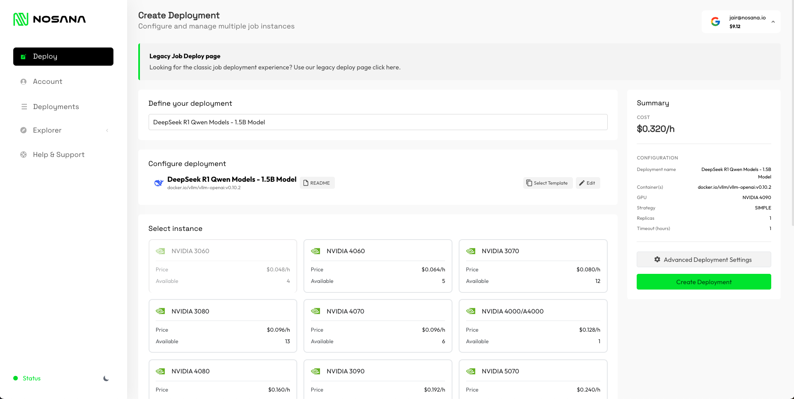
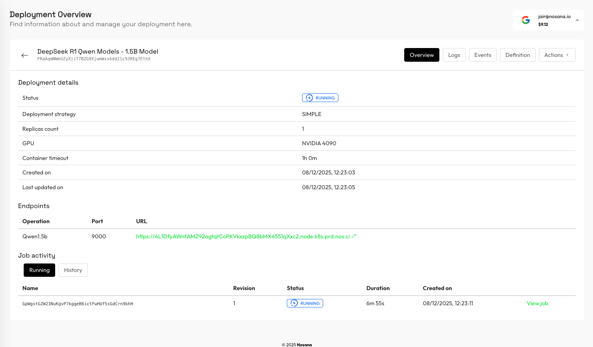
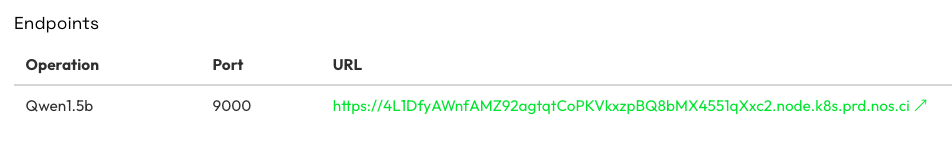

# Deploy a DeepSeek-R1 Model

Learn how to deploy a DeepSeek-R1 LLM on the Nosana network and call it through a simple HTTP API.

## Prerequisites

- **Nosana Account**: an account registred on the [Deploy Dashboard](https://deploy.nosana.com/)
- **Credit Balance**: sufficient credit balance on your Nosana account to run deployments.
- **HTTP Client**: `curl`, Postman, or any HTTP client you prefer.

## Steps

### Step 1: Create a DeepSeek-R1 deployment

In the dashboard, click on `Deploy` in the left sidebar to start creating your deployment.

Select the **DeepSeek-R1** template.




### Step 2: Select a GPU

Select a GPU for your deployment. Choose a machine that matches the requirements of the DeepSeek-R1 model you want to run. For the tutorial we will pick the NVIDIA 4090.

### Step 3: Configure deployment settings

You can use more advanced deployment settings, but for a test deployment you can use the default settings: a `SIMPLE` strategy with 1 replica and a maximum duration that fits your use case.


### Step 4: Create the deployment

Click on `Create Deployment` to finalize and create your DeepSeek-R1 deployment.

You will be redirected to the created deployment page. The deployment will automatically start. You can follow the starting progress in the `Logs` section.



### Step 5: Copy the service URL

Once the deployment has started, your endpoint to use the DeepSeek-R1 API is ready.

On the deployment details page, copy the **Endpoint URL** of the job. This will be the base URL for the DeepSeek-compatible API.

For example:

```text
https://<ID>.node.k8s.prd.nos.ci/
```



### Step 6: Call the DeepSeek-R1 Chat Completions API

You can now send prompts to the model by making a `POST` request to:

```text
SERVICE_URL/v1/chat/completions
```

For the demo we'll be using the followng JSON request body:

```json
{
  "messages": [
    { "role": "system", "content": "You are a helpful assistant." },
    {
      "role": "user",
      "content": "Give me a short fun fact about the roman empire"
    }
  ],
  "max_tokens": 4000,
  "temperature": 0.7
}
```

#### Example using curl

Replace `SERVICE_URL` with the service URL from your deployment:

```bash
SERVICE_URL="https://your-deepseek-service-url.nos.run"

curl -X POST "https://4l1dfyawnfamz92agtqtcopkvkxzpbq8bmx4551qxxc2.node.k8s.prd.nos.ci/v1/chat/completions" \
  -H "Content-Type: application/json" \
  -d '{
    "messages": [
      { "role": "system", "content": "You are a helpful assistant." },
      { "role": "user", "content": "Give me a short fun fact about the roman empire" }
    ],
    "max_tokens": 4000,
    "temperature": 0.7
  }'
```

The response will be a JSON object with metadata (such as `id`, `model`, and `usage`) and a `choices` array.  
The actual text answer from the model is inside `choices[0].message.content`. This field can contain both the model’s internal reasoning and the final answer: everything **before** the `</think>` tag is the reasoning trace, and the fun fact / final answer starts **after** `</think>`. For most use cases you only need to display or use the text after `</think>` in your application.

An example response might look like this:

```json
{
  "id": "chatcmpl-03680db79978401fbfd0ce64281bb1be",
  "object": "chat.completion",
  "created": 1765194200,
  "model": "DeepSeek-R1-Distill-Qwen-1.5B",
  "choices": [
    {
      "index": 0,
      "message": {
        "role": "assistant",
        "content": "Okay, so I need to come up with a short fun fact about the Roman Empire. Let me start by recalling what I know about the Roman Empire. It was one of the most influential empires in history, right? They ruled for about 2,000 years. They made a lot of contributions to different fields like law, literature, and engineering. I also remember that they had a lot of symbols, like the tentacle and cross for the君emere. \n\nHmm, I need to make a fun fact, so I should think of something that's interesting but not too obscure. Maybe something about their achievements. How about their road construction? I think they built a lot of roads, especially for their soldiers. That must have been a big deal because it made traveling easier and faster. So, maybe a fact about their ability to build roads quickly and efficiently.\n\nWait, is there anything else? Maybe something about their philosophy or how they organized their society. I remember they had a complex society with a mix of classes. Maybe something about how they kept the peace or their celebration methods. But probably the road construction fact is the best one because it's both fun and informative.\n\nLet me check if I can find a specific reference to this. I think I read somewhere that they built one of the world's longest roads, the .\nWait, no, that's a specific road. Maybe it's a general fact about their road-building techniques. Yeah, that sounds right. So, putting it together: the Roman Empire's ability to build long, narrow roads quickly and efficiently made their travel easier and faster than ever before, which was a significant contribution to their society.\n\nI think that's a solid fact. It's interesting because it highlights their ingenuity and the impact of their engineering on the world. I don't see any inaccuracies in that thought process, so I'll go with this.\n</think>\n\nThe Roman Empire's remarkable ability to construct long, narrow roads quickly and efficiently was a testament to their ingenuity. These roads, often referred to as the \"Luncius,\" facilitated easy travel for their military forces and soldiers, making their journey across the Mediterranean and across the globe more accessible and faster than ever before. This engineering achievement was a cornerstone of their societal development, enhancing their mobility and resilience, thus significantly influencing the world's history.",
        "refusal": null,
        "annotations": null,
        "audio": null,
        "function_call": null,
        "tool_calls": [],
        "reasoning_content": null
      },
      "logprobs": null,
      "finish_reason": "stop",
      "stop_reason": null,
      "token_ids": null
    }
  ],
  "service_tier": null,
  "system_fingerprint": null,
  "usage": {
    "prompt_tokens": 21,
    "total_tokens": 498,
    "completion_tokens": 477,
    "prompt_tokens_details": null
  },
  "prompt_logprobs": null,
  "prompt_token_ids": null,
  "kv_transfer_params": null
}
```

In this example, the actual fun fact returned by the model (the part after `</think>`) is:

> The Roman Empire's remarkable ability to construct long, narrow roads quickly and efficiently was a testament to their ingenuity. These roads, often referred to as the "Luncius," facilitated easy travel for their military forces and soldiers, making their journey across the Mediterranean and across the globe more accessible and faster than ever before. This engineering achievement was a cornerstone of their societal development, enhancing their mobility and resilience, thus significantly influencing the world's history.

When you no longer need the endpoint, you can stop the deployment from the dashboard.  
Go to the **Deployments** overview page, open the **Actions** menu for your DeepSeek-R1 deployment, and click **Stop deployment**.
