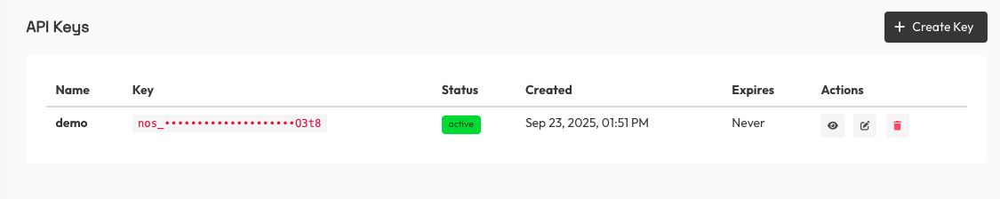
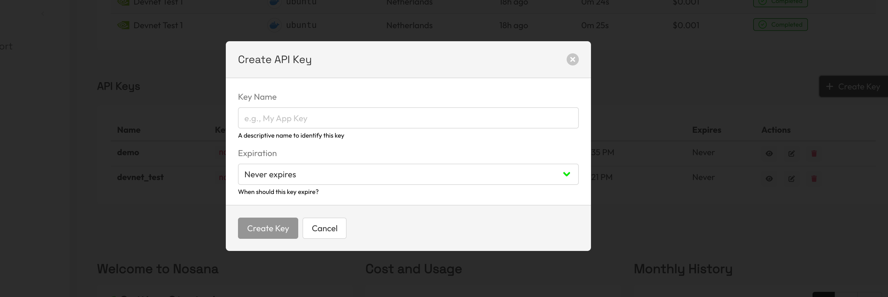

# How to Get an API Key

## Get an <Glossary term="API Key">API Key</Glossary>

### Step 1: Access Nosana Deploy
Log in to the <Glossary term="Nosana Deploy"><a href="https://deploy.nosana.com">Nosana Deploy</a></Glossary> with your Nosana account and navigate to the `Account` page.

### Step 2: Generate API Key
In the `API Keys` section on the Account page, you can view your existing API keys and create new ones.

Click `Create Key` to generate a new API key. Give your new key a descriptive name and an expiration date. Once you've filled in both, your API key will be shown with an option to copy it.

::::warning
Keep your API key **private**. Do not share it publicly, include it in client-side code, or commit it to version control. If you suspect your key has been exposed, revoke it immediately and create a new one.
::::

## Next Steps

- [My First Deployment](./my-first-deployment.md)

