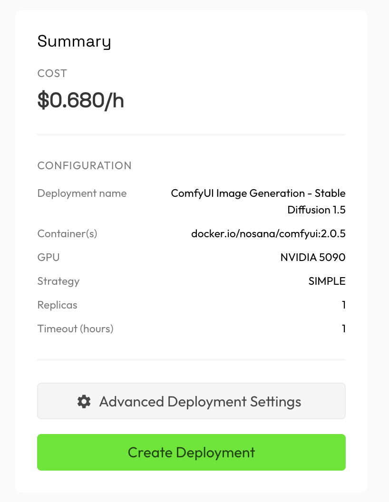
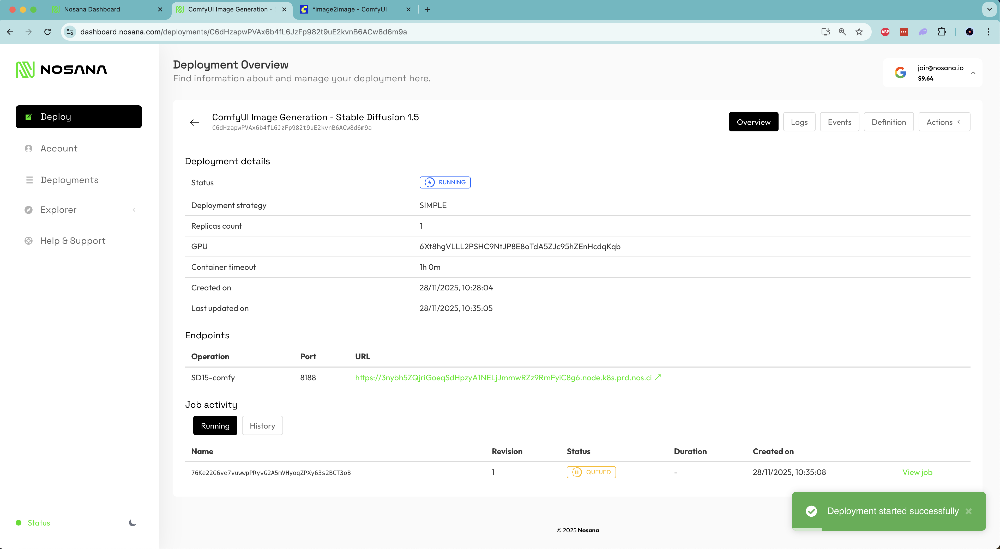
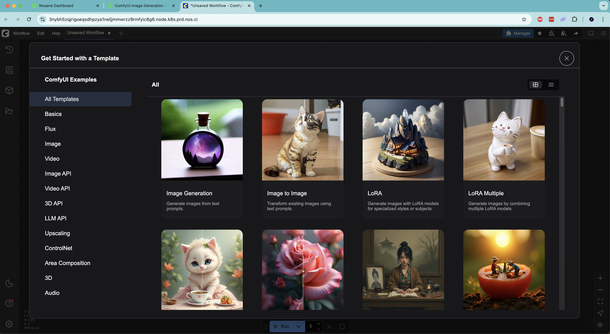
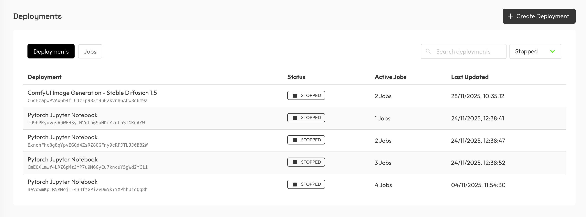

# My First Deployment

A step-by-step guide to creating your first deployment on Nosana through the Nosana dashboard.

## Prerequisites

- **Nosana Deploy Account**: an account registred on [Nosana Deploy](https://deploy.nosana.com/)
- **Credit Balance**: Sufficient credit balance on your Nosana account to run deployments.

## Steps

### Step 1: Click on 'Deploy'

In the dashboard, click on 'Deploy' in the left sidebar to start creating your deployment.

### Step 2: Configure your deployment

Fill in a name and select a template. For this demo, we'll be using a ComfyUI Image Generation template. You can use the default template for now, or click 'Edit' to access more advanced settings.

### Step 3: Select a GPU

Select a GPU for your deployment. For this demo, we'll select an NVIDIA 5090.

### Step 4: Configure deployment settings

You can use more advanced deployment settings, but for this demo we'll use the default settings: a `SIMPLE` strategy with 1 replica and a maximum duration of 1 hour.

### Step 5: Create the deployment

Click on 'Create Deployment' to finalize and create your deployment.

### Step 6: Deployment starts automatically

You will be redirected to the created deployment page. The deployment will automatically start. You can follow the starting progrress in the 'Logs' section.

### Step 7: Access your endpoint

Once the deployment has started, your endpoint to use the ComfyUI is ready. Click on the endpoint link to access the server.

## Congratulations!

Woohoo! You have run your first deployment on Nosana.

## Viewing Your Deployments

You can find an overview of all your deployments on the Deployments page in the left sidebar.

